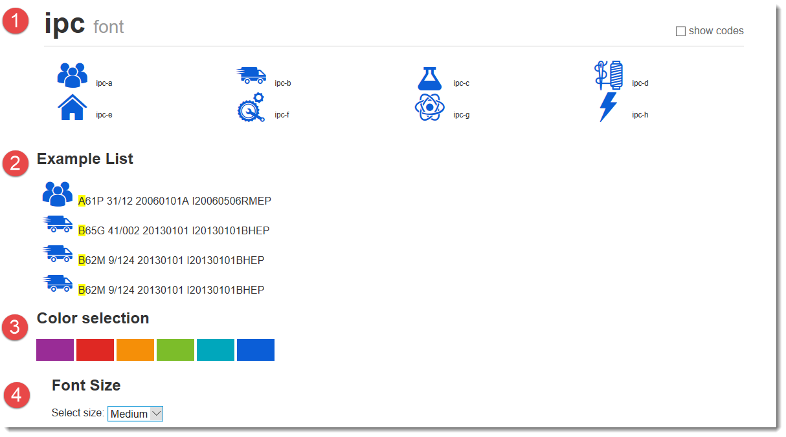

# IPC Classification 

According to WIPO wesite ([WIPO Classification Page](http://web2.wipo.int/classifications/ipc/ipcpub?notion=scheme&version=20180101&symbol=none&menulang=en&lang=en&viewmode=f&fipcpc=no&showdeleted=yes&indexes=no&headings=yes&notes=yes&direction=o2n&initial=A&cwid=none&tree=no&searchmode=smart)) there are the following main classifications.

- A - Human Necessities;
- B - Performing Operations; Transporting;
- C - Chemistry; Metallurgy;
- D - Texttiles; Paper;
- E - Fixed Constructions;
- F - Mechanical Engineering; Lighting; Heating; Weapons; Blasting;
- G - Physics;
- H - Electricity;

# Getting Icons

Searching images for icon ideas can be achieved with help of Google images.
Drawing images can be done with free tools such as Inkscape.
[Inkscape Portable](https://portableapps.com/apps/graphics_pictures/inkscape_portable)

# Usage

To use the font in you HTML project check the `example` folder.

## Importing 

Execute the command by doing `command.exe`

Point to consider
- Point 1  
- Point 2
- Point 3

# Usage 

To import the font face `ipc` insert the code in your page `style` block.

    @font-face {
          font-family: 'ipc';
          src: url('./font/ipc.eot?60496415');
          src: url('./font/ipc.eot?60496415#iefix') format('embedded-opentype'),
               url('./font/ipc.woff?60496415') format('woff'),
               url('./font/ipc.ttf?60496415') format('truetype'),
               url('./font/ipc.svg?60496415#ipc') format('svg');
          font-weight: normal;
          font-style: normal;
        }
        
    .demo-icon
    {
      font-family: "ipc";
      font-style: normal;
      font-weight: normal;
      speak: none;
     
      display: inline-block;
      text-decoration: inherit;
      width: 1em;
      margin-right: .2em;
      text-align: center;
      /* opacity: .8; */
     
      /* For safety - reset parent styles, that can break glyph codes*/
      font-variant: normal;
      text-transform: none;
     
      /* fix buttons height, for twitter bootstrap */
      line-height: 1em;
     
      /* Animation center compensation - margins should be symmetric */
      /* remove if not needed */
      margin-left: .2em;
     
      /* You can be more comfortable with increased icons size */
      /* font-size: 120%; */
     
      /* Font smoothing. That was taken from TWBS */
      -webkit-font-smoothing: antialiased;
      -moz-osx-font-smoothing: grayscale;
     
      /* Uncomment for 3D effect */
      /* text-shadow: 1px 1px 1px rgba(127, 127, 127, 0.3); */
    }        

## Color

Changing color can be done using CSS:

	color:#F00; // Red - Use another hex decimal code color

Check [Safe Web Colors](https://en.wikipedia.org/wiki/Web_colors) list to get safe color codes for web.

## Size

Size can be changed using: 

	font-size:32px; // to have a 32 pixel icon 
    
    
